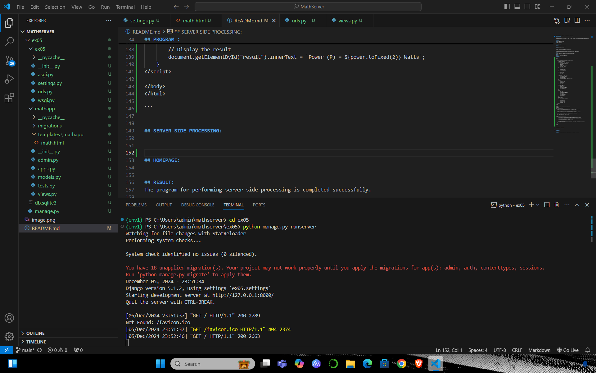
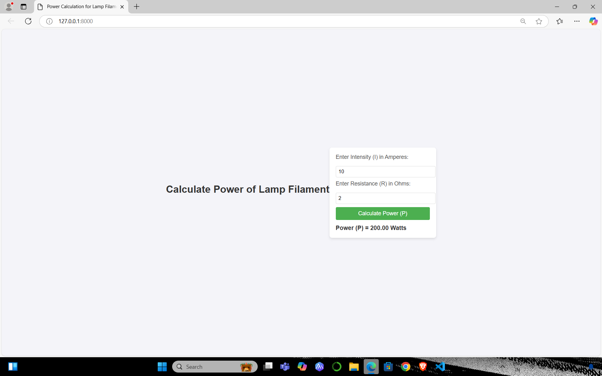

# Ex.05 Design a Website for Server Side Processing
## Date:5/12/24

## AIM:
 To design a website to calculate the power of a lamp filament in an incandescent bulb in the server side. 


## FORMULA:
P = I<sup>2</sup>R
<br> P --> Power (in watts)
<br> I --> Intensity
<br> R --> Resistance

## DESIGN STEPS:

### Step 1:
Clone the repository from GitHub.

### Step 2:
Create Django Admin project.

### Step 3:
Create a New App under the Django Admin project.

### Step 4:
Create python programs for views and urls to perform server side processing.

### Step 5:
Create a HTML file to implement form based input and output.

### Step 6:
Publish the website in the given URL.

## PROGRAM :
```
<!DOCTYPE html>
<html>
<head>
    <title>Power Calculation for Lamp Filament</title>
    <style>
        body {
            font-family: Arial, sans-serif;
            background-color: #f4f4f9;
            margin: 0;
            padding: 0;
            display: flex;
            justify-content: center;
            align-items: center;
            height: 100vh;
        }

        header {
            text-align: center;
            margin-bottom: 20px;
        }

        h1 {
            font-size: 2em;
            color: #333;
        }

        .container {
            background-color: #fff;
            padding: 20px;
            border-radius: 8px;
            box-shadow: 0 4px 8px rgba(0, 0, 0, 0.1);
            width: 300px;
        }

        label {
            font-size: 1.1em;
            margin-bottom: 8px;
            display: block;
            color: #555;
        }

        input[type="number"] {
            width: 100%;
            padding: 8px;
            margin: 10px 0;
            border: 1px solid #ddd;
            border-radius: 4px;
            font-size: 1em;
        }

        button {
            width: 100%;
            padding: 10px;
            background-color: #4CAF50;
            color: white;
            border: none;
            border-radius: 4px;
            font-size: 1.1em;
            cursor: pointer;
        }

        button:hover {
            background-color: #45a049;
        }

        .result {
            margin-top: 15px;
            font-size: 1.2em;
            color: #333;
            font-weight: bold;
        }
    </style>
</head>
<body>

<header>
    <h1>Calculate Power of Lamp Filament</h1>
</header>

<div class="container">
    <form method="POST">
        <label for="intensity">Enter Intensity (I) in Amperes:</label>
        <input type="number" id="intensity" name="intensity" step="any" placeholder="Intensity (I)" required>

        <label for="resistance">Enter Resistance (R) in Ohms:</label>
        <input type="number" id="resistance" name="resistance" step="any" placeholder="Resistance (R)" required>

        <button type="submit">Calculate Power (P)</button>
    </form>

    
    <div class="result">
        
            Power (P) = {{ power }} Watts
        
            {{ power }}
        
    </div>
    
</div>

</body>
</html>


```


## SERVER SIDE PROCESSING:



## HOMEPAGE:


## RESULT:
The program for performing server side processing is completed successfully.
